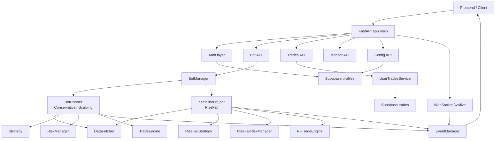
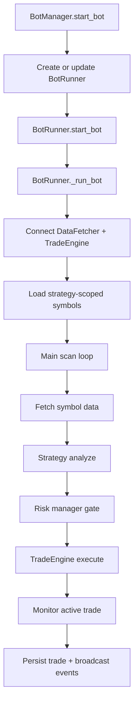

# Complete System Architecture

This document consolidates the current architecture for all trading strategies and the FastAPI layer in this repository.

It is based on the code paths that are active today, especially:

- `strategy_registry.py`
- `app/main.py`
- `app/bot/manager.py`
- `app/bot/runner.py`
- `app/api/*.py`
- `app/ws/live.py`
- `conservative_strategy/*`
- `scalping_strategy/*`
- `risefallbot/*`

## 1. System Overview

The project has two major runtime planes:

1. Strategy execution plane
   - Conservative multiplier bot
   - Scalping multiplier bot
   - Rise/Fall contract bot

2. API control plane
   - FastAPI REST endpoints
   - WebSocket live updates
   - Supabase-backed auth, profile storage, and trade persistence

At a high level:



## 2. Main Runtime Layers

### 2.1 Strategy registry

`strategy_registry.py` is the canonical mapping from strategy name to implementation pair:

- `Conservative` -> `ConservativeStrategy`, `ConservativeRiskManager`
- `Scalping` -> `scalping_strategy.strategy_external.ScalpingStrategy`, `ScalpingRiskManager`
- `RiseFall` -> `RiseFallStrategy`, `RiseFallRiskManager`

It also:

- normalizes aliases like `rf`, `scalp`, and case differences
- gates optional strategies behind environment flags:
  - `SCALPING_BOT_ENABLED`
  - `RISE_FALL_BOT_ENABLED`
- falls back to `Conservative` when feature flags are respected and a strategy is disabled

### 2.2 Common contracts

The multiplier strategies follow shared interfaces:

- `base_strategy.py`
  - `analyze(...)`
  - `get_required_timeframes()`
  - `get_strategy_name()`

- `base_risk_manager.py`
  - `can_trade()`
  - `record_trade_open(...)`
  - `record_trade_closed(...)`
  - `get_current_limits()`
  - `reset_daily_stats()`

The conservative package uses wrappers to adapt older production logic to these interfaces:

- `conservative_strategy/strategy_wrapper.py`
- `conservative_strategy/risk_wrapper.py`

Scalping already implements the interface directly inside its package.

Rise/Fall is partially separate by design: it is registered in the same strategy registry, but runtime execution is not delegated to `BotRunner`.

## 3. Strategy Architecture

## 3.1 Conservative strategy

Files:

- `conservative_strategy/config.py`
- `conservative_strategy/strategy.py`
- `conservative_strategy/risk_manager.py`
- `conservative_strategy/strategy_wrapper.py`
- `conservative_strategy/risk_wrapper.py`

Purpose:

- multiplier-contract strategy
- top-down, multi-timeframe market structure analysis
- broad symbol universe
- dynamic TP/SL from structure instead of fixed percentages

Timeframes:

- `1w`, `1d`, `4h`, `1h`, `5m`, `1m`

Core decision pipeline:

1. Validate all six timeframes.
2. Calculate momentum filters such as RSI and ADX.
3. Reject late entries and parabolic spikes.
4. Build weekly and daily directional bias.
5. Find structure levels across higher timeframes.
6. Select target and stop based on market structure.
7. Validate breakout or weak retest entry on lower timeframes.
8. Require minimum risk/reward.
9. Emit `UP` or `DOWN` signal with TP, SL, confidence, and details.

Risk model highlights:

- global active-trade tracking across the conservative symbol set
- max concurrent positions from config
- cooldown, daily loss, and daily trade caps
- trailing and stagnation exit controls
- recovery of existing broker positions on restart
- active trades mirrored to `UserTradesService` for persistence

Mental model:

```text
Higher timeframe bias
-> market structure levels
-> lower timeframe trigger
-> dynamic TP/SL
-> multiplier execution
```

## 3.2 Scalping strategy

Files:

- `scalping_strategy/config.py`
- `scalping_strategy/strategy_external.py`
- `scalping_strategy/risk_manager.py`

Purpose:

- fast multiplier-contract strategy
- isolated symbol universe and isolated config
- simpler signal generation than the conservative strategy
- much tighter risk throttles

Timeframes:

- `1h`, `5m`, `1m`

Core decision pipeline:

1. Require all three timeframes.
2. Align `1h` and `5m` EMA direction.
3. Read RSI and ADX from the last closed `1m` candle.
4. Enforce symbol-aware ADX threshold.
5. Enforce direction-aware RSI band.
6. Reject excessive short-term movement.
7. Require momentum breakout.
8. Reject parabolic spike conditions.
9. Build ATR-based TP/SL and require minimum R:R.

Risk model highlights:

- `SCALPING_MAX_CONCURRENT_TRADES` portfolio cap
- per-symbol concurrent cap
- daily hard cap from config
- global and symbol-specific cooldowns
- short-loss suppression
- rolling multi-day performance guard
- persisted daily counters and cooldown state in Supabase
- runtime trade metadata for trailing and stagnation exits

Mental model:

```text
EMA trend alignment
-> RSI/ADX quality gate
-> movement and momentum gate
-> ATR TP/SL
-> very strict trade-frequency controls
```

## 3.3 Rise/Fall strategy

Files:

- `risefallbot/rf_config.py`
- `risefallbot/rf_strategy.py`
- `risefallbot/rf_risk_manager.py`
- `risefallbot/rf_trade_engine.py`
- `risefallbot/rf_bot.py`

Purpose:

- separate Deriv Rise/Fall contract bot
- independent from multiplier execution logic
- single active lifecycle enforced per user bot instance

Important difference:

- Conservative and Scalping run through `BotRunner`
- Rise/Fall runs through `risefallbot.rf_bot.run(...)` managed directly by `BotManager`

Core decision and execution pipeline:

1. `BotManager` acquires a Supabase-backed session lock.
2. `rf_bot.run(...)` creates strategy, risk, market data, and trade engine objects.
3. The scan loop checks halted state and active-trade mutex state.
4. `_process_symbol(...)` fetches candles and asks `RiseFallStrategy` for a signal.
5. `RiseFallRiskManager` acquires a trade lock.
6. `RFTradeEngine` buys the contract.
7. Trade-open state is recorded.
8. Contract monitoring continues until settlement.
9. Closed trade is written to Supabase.
10. Lock is released only after persistence completes.

Risk model highlights:

- strict one-trade lifecycle mutex
- session lock across processes
- per-symbol and global cooldowns
- daily caps and loss caps
- halted state when critical failures happen
- lock intentionally held through DB persistence

Mental model:

```text
signal approval
-> trade mutex
-> contract buy
-> contract monitoring
-> DB persistence
-> unlock
```

## 4. Execution Architecture

## 4.1 Multiplier strategies: `BotRunner`

`app/bot/runner.py` is the orchestration engine for Conservative and Scalping.

Main responsibilities:

- initialize user-specific data and trade connections
- bind symbol scope to active strategy
- run the main scan loop
- fetch required timeframes per symbol
- execute concurrent symbol analysis
- prevent duplicate winner selection in a cycle
- route order execution through `TradeEngine`
- keep `BotState` updated for API and WebSocket consumers

High-level flow:



Concurrency protections inside `BotRunner`:

- `_execution_mutex`
  - serializes trade execution path
- `_cycle_claim_mutex`
  - prevents multiple symbols from claiming the same cycle winner

## 4.2 Rise/Fall runtime

`app/bot/manager.py` bypasses `BotRunner` for Rise/Fall and launches `risefallbot.rf_bot.run(...)` as a dedicated asyncio task.

That separation exists because Rise/Fall needs:

- different contract type
- different trade engine
- different lifecycle lock model
- different session-lock behavior

## 5. FastAPI Layer

## 5.1 Application entry point

`app/main.py` creates the FastAPI application and wires:

- lifespan startup and shutdown
- CORS
- rate limiting via `slowapi`
- secure headers
- router registration
- WebSocket router registration
- shutdown cleanup through `bot_manager.stop_all()`

Main mounted routers:

- `/api/v1/auth`
- `/api/v1/bot`
- `/api/v1/trades`
- `/api/v1/monitor`
- `/api/v1/config`
- `/ws`

Base utility endpoints:

- `GET /`
- `GET /health`

## 5.2 Authentication and user context

Auth is Supabase-backed.

Key pieces:

- `app/core/auth.py`
- `app/core/supabase.py`
- `app/api/auth.py`
- `app/ws/live.py`

Usage model:

- frontend handles login with Supabase
- API routes depend on authenticated current user
- profile data in Supabase drives bot startup configuration
- WebSocket can optionally enforce auth through `WS_REQUIRE_AUTH`

## 5.3 Bot control API

`app/api/bot.py`

Routes:

- `POST /api/v1/bot/start`
- `POST /api/v1/bot/stop`
- `POST /api/v1/bot/restart`
- `GET /api/v1/bot/status`

Startup behavior:

1. Load `profiles` row from Supabase.
2. Decrypt stored Deriv API key.
3. Read stake, active strategy, and `auto_execute_signals`.
4. Hand control to `BotManager.start_bot(...)`.

## 5.4 Configuration API

`app/api/config.py`

Routes:

- `GET /api/v1/config/current`
- `PUT /api/v1/config/update`

What it manages:

- Deriv API key in encrypted storage
- stake amount
- active strategy
- `auto_execute_signals`
- selected live-updatable global risk knobs

## 5.5 Trades API

`app/api/trades.py`

Routes:

- `GET /api/v1/trades/active`
- `POST /api/v1/trades/active/sync`
- `GET /api/v1/trades/history`
- `GET /api/v1/trades/stats`
- `GET /api/v1/trades/stats/debug`
- `PATCH /api/v1/trades/active/{contract_id}/exit-controls`

Important behavior:

- reads active trades from runtime first
- falls back to persistent Supabase open trades
- can import already-open broker contracts into local tracking
- keeps trailing/stagnation toggles durable across refreshes and restarts

## 5.6 Monitoring API

`app/api/monitor.py`

Routes:

- `GET /api/v1/monitor/signals`
- `GET /api/v1/monitor/performance`
- `GET /api/v1/monitor/logs`

It combines:

- runtime bot metrics from `BotState`
- process metrics from `psutil`
- log-file filtering by user and active strategy
- scalping-specific gate frequency metrics when relevant

## 5.7 WebSocket live layer

`app/ws/live.py` exposes:

- `WS /ws/live`

Responsibilities:

- authenticate websocket user when token is provided
- send initial state snapshot
- stream real-time events from `EventManager`
- optionally reject unauthenticated connections when `WS_REQUIRE_AUTH=true`

`app/bot/events.py` is the in-memory event bus:

- stores active websocket connections
- broadcasts only to the matching `account_id`
- also calls registered internal event handlers, such as Telegram bridges

## 6. Persistence Architecture

Supabase is the persistent control and data store.

Main tables implied by the code and setup SQL:

- `profiles`
  - user-level config
  - encrypted Deriv API key
  - active strategy
  - stake amount
  - execution mode flags

- `trades`
  - active open trades
  - closed trades
  - PnL, status, timestamps, strategy type, runtime exit toggles

- `scalping_runtime_state`
  - persisted daily counts
  - persisted cooldown state for scalping risk guardrails

- Rise/Fall session-lock storage
  - used to prevent duplicate bot instances across processes

Service layer:

- `app/services/trades_service.py`

Responsibilities:

- track open trades
- persist closed trades
- repair stale rows
- serve active/history/stats views
- invalidate local cache entries

## 7. Setup Architecture

## 7.1 Required environment configuration

The setup knobs visible in `.env.example` and settings are:

- Core app
  - `ENVIRONMENT`
  - `PORT`
  - `DEBUG`

- Bot control
  - `BOT_AUTO_START`
  - `ALLOW_BOT_CONTROL`
  - `REQUIRE_AUTH_FOR_BOT_CONTROL`

- Strategy feature flags
  - `SCALPING_BOT_ENABLED`
  - `RISE_FALL_BOT_ENABLED`

- Supabase
  - `SUPABASE_URL`
  - `SUPABASE_SERVICE_ROLE_KEY`
  - `SUPABASE_ANON_KEY`
  - `DERIV_API_KEY_ENCRYPTION_SECRET`

- Deriv
  - `DERIV_APP_ID`
  - `DERIV_API_TOKEN`

- Optional integrations
  - `TELEGRAM_BOT_TOKEN`
  - `TELEGRAM_CHAT_ID`
  - `CORS_ORIGINS`
  - `RATE_LIMIT_ENABLED`

## 7.2 Boot sequence

```text
1. app/core/settings.py loads env-backed settings
2. app/core/supabase.py creates the Supabase client
3. app/main.py builds the FastAPI app
4. Routers and middleware are attached
5. Users authenticate through Supabase-backed API access
6. Bot start request loads profile and selected strategy
7. BotManager launches either:
   - BotRunner for Conservative/Scalping
   - rf_bot task for RiseFall
```

## 7.3 Database setup

Repository SQL files:

- `supabase_setup.sql`
- `supabase_trades.sql`
- `secure_rls.sql`

These are the core setup artifacts for:

- base schema
- trades persistence
- row-level security policies

## 8. End-to-End Control Flow

## 8.1 Starting a multiplier bot

```text
Frontend
-> POST /api/v1/bot/start
-> app/api/bot.py
-> load profile + decrypt Deriv key
-> BotManager.start_bot(...)
-> strategy_registry.get_strategy(...)
-> BotRunner.start_bot(...)
-> BotRunner._run_bot()
-> scan/analyze/execute loop
-> events + DB persistence
```

## 8.2 Starting a Rise/Fall bot

```text
Frontend
-> POST /api/v1/bot/start
-> active_strategy resolves to RiseFall
-> BotManager._start_risefall_bot(...)
-> Supabase session lock acquired
-> risefallbot.rf_bot.run(...)
-> scan/analyze/buy/monitor/persist/unlock
```

## 8.3 Trade visibility path

```text
Runtime strategy/risk/engine
-> EventManager broadcast
-> WebSocket client updates

Runtime trade + closed trade
-> UserTradesService
-> Supabase trades table
-> /api/v1/trades/* and /api/v1/monitor/* endpoints
```

## 9. Design Decisions That Matter

- Strategy isolation is real.
  - Conservative, Scalping, and Rise/Fall each own their own config and risk behavior.

- Conservative and Scalping share the same orchestration shell.
  - `BotRunner` is the reusable multiplier execution framework.

- Rise/Fall is intentionally special-cased.
  - It has its own engine and stricter lifecycle locking, so it is managed as a separate task path.

- Supabase is not just storage.
  - It is also part of coordination, auth, config sourcing, and duplicate-instance protection.

- Open trades are persisted.
  - Active positions survive UI refreshes and bot restarts better because open trade rows are stored, not kept only in memory.

- WebSocket delivery is user-scoped.
  - `account_id` filtering keeps live events isolated per user session.

## 10. Recommended Mental Model

Think about the system in five layers:

```text
Layer 1: Delivery
  FastAPI routers + WebSocket endpoint

Layer 2: Control
  BotManager chooses and launches the correct bot runtime

Layer 3: Orchestration
  BotRunner for multiplier bots, rf_bot for Rise/Fall

Layer 4: Trading logic
  Strategy + RiskManager + TradeEngine

Layer 5: Persistence and integrations
  Supabase + cache + logs + Telegram + websocket broadcasts
```

If you remember only one rule, it is this:

```text
FastAPI controls who can start a bot and with what profile,
the manager selects the runtime,
the runtime delegates to the strategy and risk manager,
and all meaningful trade state is pushed outward to both
Supabase and the live event stream.
```
